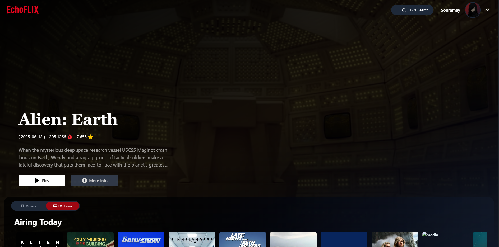
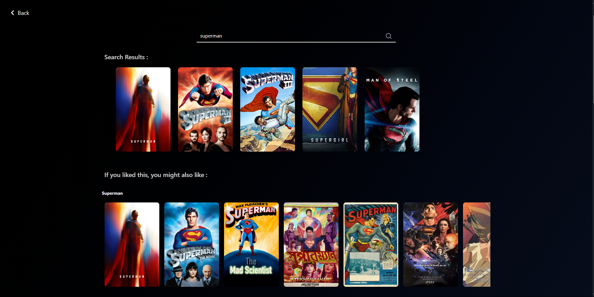

# EchoFlix

EchoFlix is a modern movie browsing and recommendation web app built with React. It features movie details, trailers, cast info, reviews, gallery, and smart search powered by GPT.

## Live Demo

Visit the app: [https://echo-flix.web.app/](https://echo-flix.web.app/)

## Screenshot







## Features

- Browse trending , recent or any movies ot tv shows or series.
- View detailed movie info, cast, reviews, and gallery.
- Watch trailers and clips
- Smart GPT-powered movie search
- Responsive design for all devices
- User authentication (Sign Up / Sign In)
- Personalized user profile


## Tech Stack

- **Frontend:** React, Tailwind CSS
- **State Management:** Redux
- **Authentication:** Firebase
- **APIs:** TMDB (The Movie Database)
- **Search:** GPT integration

## Folder Structure

```
src/
  components/         # UI components (Browse, MovieDetail, Footer, etc.)
  utils/              # Utility functions, constants, hooks, redux slices
  index.css           # Global styles
  App.jsx             # Main app component
  main.jsx            # Entry point
```


## Credits

Developed by **Souramay Bhowmik**  
B.Tech Computer Science and Engineering - 2026

## License

This project is for educational and personal use.